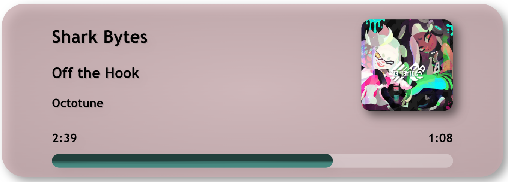
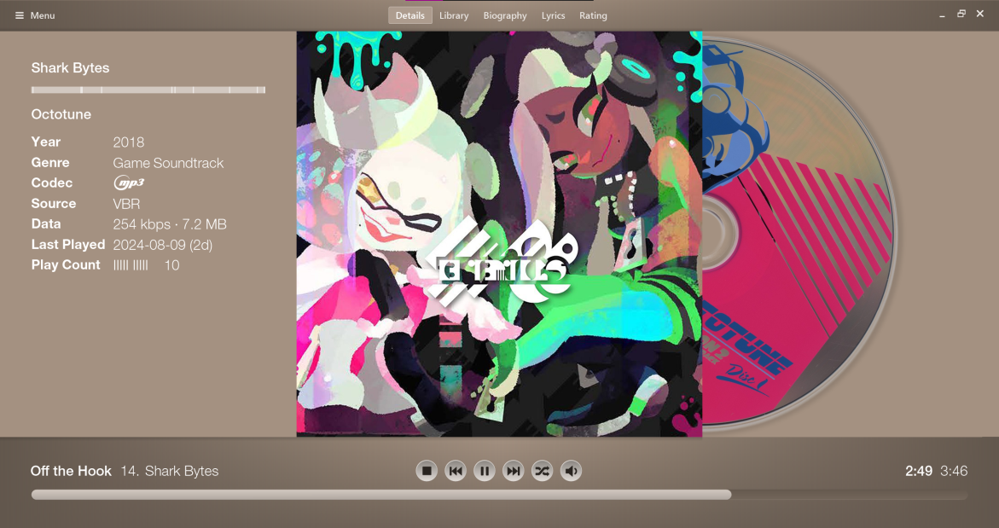
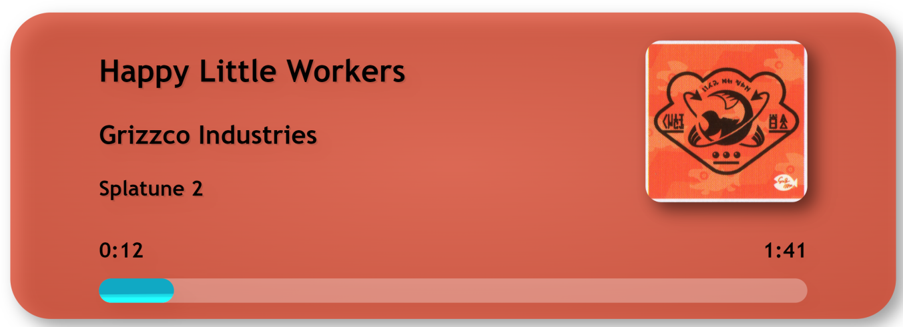
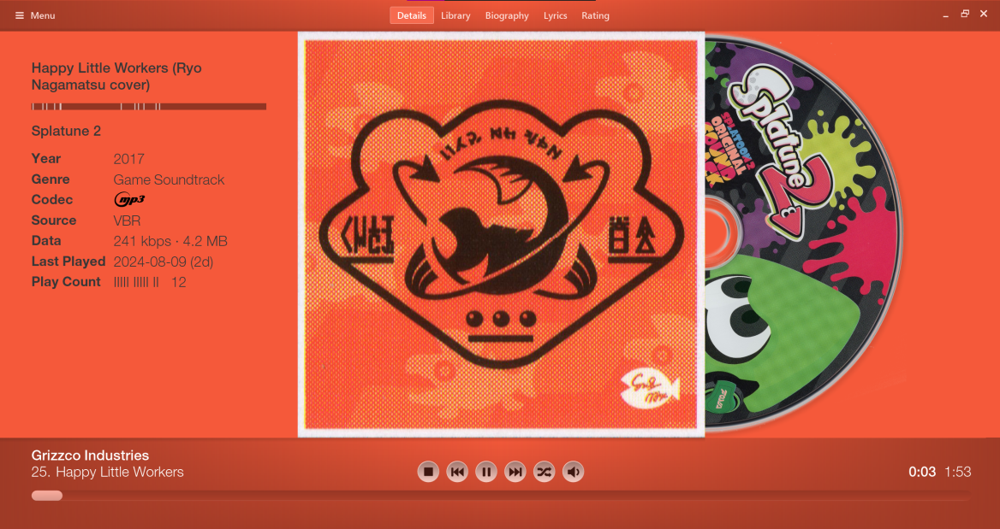
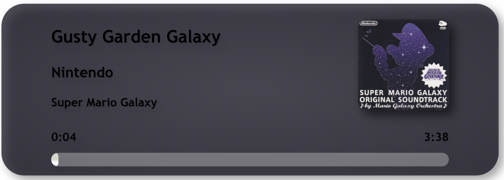
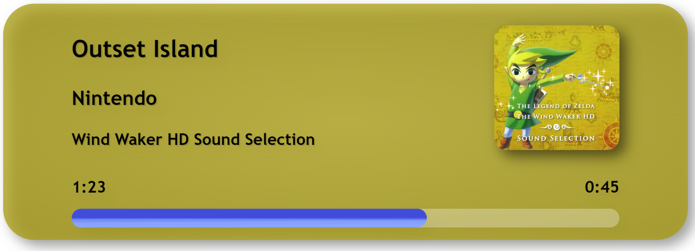
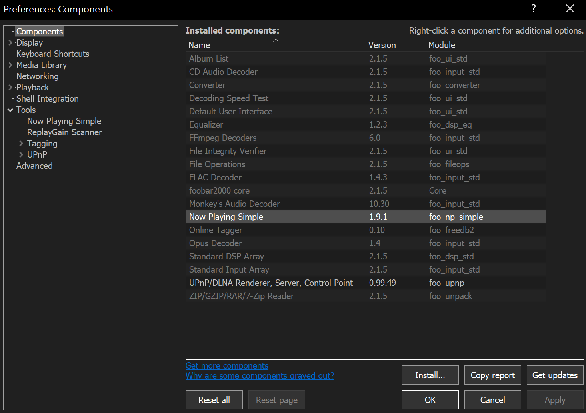
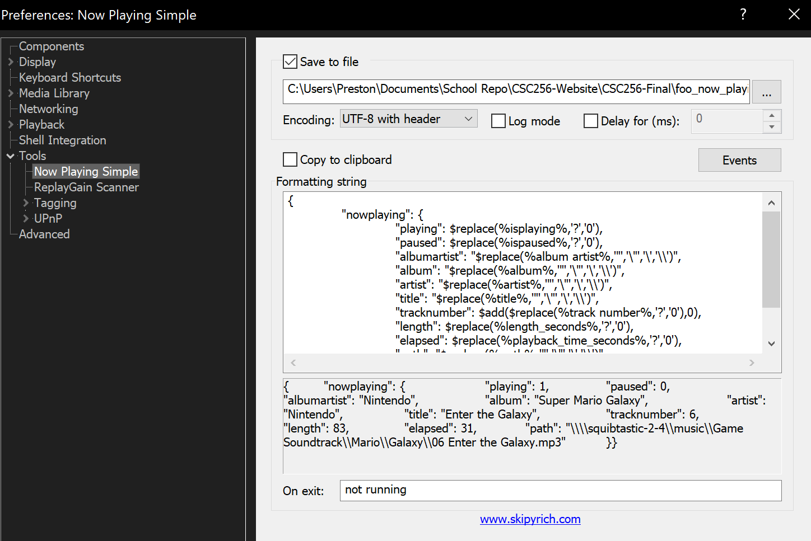

# OBS FoobarFusion

## Assignment 13.1: Final Project Code Deliverable
This project allows users to have a local webpage that displays the current song playing in Foobar2000. This is done by using the Foobar2000 API and the [Foobar2000 Component](./foo_component/readme.md)\
Currently the component has been deprecated, however it is still functional.\
An alternative is planned to be created at a later date.
### Screenshots

HTML Document

Foobar2000 + Geogia Reborn

HTML Document

Foobar2000 + Geogia Reborn

HTML Document

HTML Document



## Setup
For an indepth guide please visit the home.html document 
<!-- TODO: Add a link to the guide -->
### Foobar

#### Install Application
1. Go to the [Foobar2000 website](https://www.foobar2000.org)
2. Go to download
3. Download windows x64 or x86
4. Follow instillation wizzard
5. **Install as portable**

#### Install component
1. Download the component [here](./foo_component/readme.md)
2. Open the foobar portable instilation folder
3. Save the file in `foobar2000\components`
4. Restart Foobar2000

1. Navigate to file
2. Open preferences (ctrl+p)
3. Open components 
4. Verify that `Now Playing Simple` shows up



#### Setup NowPlaying

1. Go to file
2. Go to preferences (ctrl+P)
3. Go to tools
4. Go to Now Playing Simple
5. Click the "..." to open file explorer for the path of the json file
6. Select the json file (if there is not one, name it `foo_now_playing.json`)
7. Click events
8. Check all events
9. Input the following formatting string:
```
{
	"nowplaying": {
		"playing": $replace(%isplaying%,'?','0'),
		"paused": $replace(%ispaused%,'?','0'),
		"albumartist": "$replace(%album artist%,'"','\"','\','\\')",
		"album": "$replace(%album%,'"','\"','\','\\')",
		"artist": "$replace(%artist%,'"','\"','\','\\')",
		"title": "$replace(%title%,'"','\"','\','\\')",
		"tracknumber": $add($replace(%track number%,'?','0'),0),
		"length": $replace(%length_seconds%,'?','0'),
		"elapsed": $replace(%playback_time_seconds%,'?','0'),
		"path": "$replace(%path%,'"','\"','\','\\')"
	}
}
```

